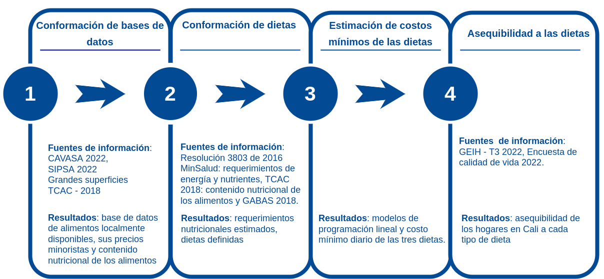

```{r setup, include=FALSE}
options(htmltools.dir.version = FALSE)
knitr::opts_chunk$set(
  fig.width=9, fig.height=3.5, fig.retina=3,
  out.width = "100%",
  cache = FALSE,
  echo = TRUE,
  message = FALSE, 
  warning = FALSE,
  hiline = TRUE
)
```

```{r xaringan-themer, include=FALSE, warning=FALSE}
library(xaringanthemer)
style_duo_accent(
  primary_color = "#0073E6",
  secondary_color = "#80BFFF",
  inverse_header_color = "#0059B3"
)
```

class: inverse, center, middle
background-image: url(img/fondo0.png)  /* Reemplaza "path_to_image.png" con la ruta de tu imagen de fondo */
background-size: 100% 100%
background-position: center

# Jornada de investigación
### Departamento de Ciencias Naturales y Matemáticas  

<br/>

### Daniel Enrique González Gómez
### septiembre 2 de 2023

---

# **Lineas de investigación**

### Economía de la Educación

* Elección de la carrera
* Rendimiento académico y deserción

GEMTE

### **Calidad de aire **

* Análisis de series de tiempo para la predicción de ozono en Cali
* Indice integrado de calidad del aire para ciudades colombianas
* Predicción de la calidad del aire

PML
---
name: colors

### **Sistemas alimentarios**

|Proyecto | Nombre                                                                                                   |
|:--------|:----------------------------------------------------------------------------------------------------------|
| **1.**  | Estimación de los costos mínimos  y asequibiliad de una dieta suficiente en energía, una dieta adecuada en nutrientes y una dieta saludable para la población urbana de Cali.|
| **2.**  | Constricción de paquete R para determinar los costos mínimos y su asequibilidad para las tres dietas (CoCO, CoNA , CoRD).|
| **3.**  | Estacionalidad en de los costos mínimos de una dieta adecuada en nitrientes para hogares urbanos de Cali.|


```{r, echo=FALSE, out.width="50%", fig.align = "center"}

```
---

###  **Equipo** 

|Equipos                                 | $\hspace{.5cm}$ 1 $\hspace{.5cm}$ | $\hspace{.5cm}$  2 $\hspace{.5cm}$ | $\hspace{.5cm}$  3 $\hspace{.5cm}$ | 
|:----------------------------------------------------- |:------------------:|:-------------------:|:-------------------:|
| Ana Milena Yioshoka - FCEA                            | x                  | x                   | x  | 
| Luis Eduardo Girón - FCEA                             | x                  | x                   | x  |
| Maria del Pilar Zea - FS                              | x                  | x                   | x  |
| Daniel Enrique González - FIC                         | x                  | x                   | x  |
| Serbio Barona - economista-filósofo                   | x                  | x                   | x  |
| Heydi Valencia - nutricionista                        | x                  |                     |    |
| Juan Camilo Ordoñez - estadístico                     |                    | x                   | x  |
| Estudiantes de maestria                               |                    |                     | x  |   


```{r, echo=FALSE, out.width="50%", fig.align = "center"}

```

---

### **Plaza Colombia**

*  https://plasacolombia.com/nosotros/

---

class: center, middle

# Gracias!
